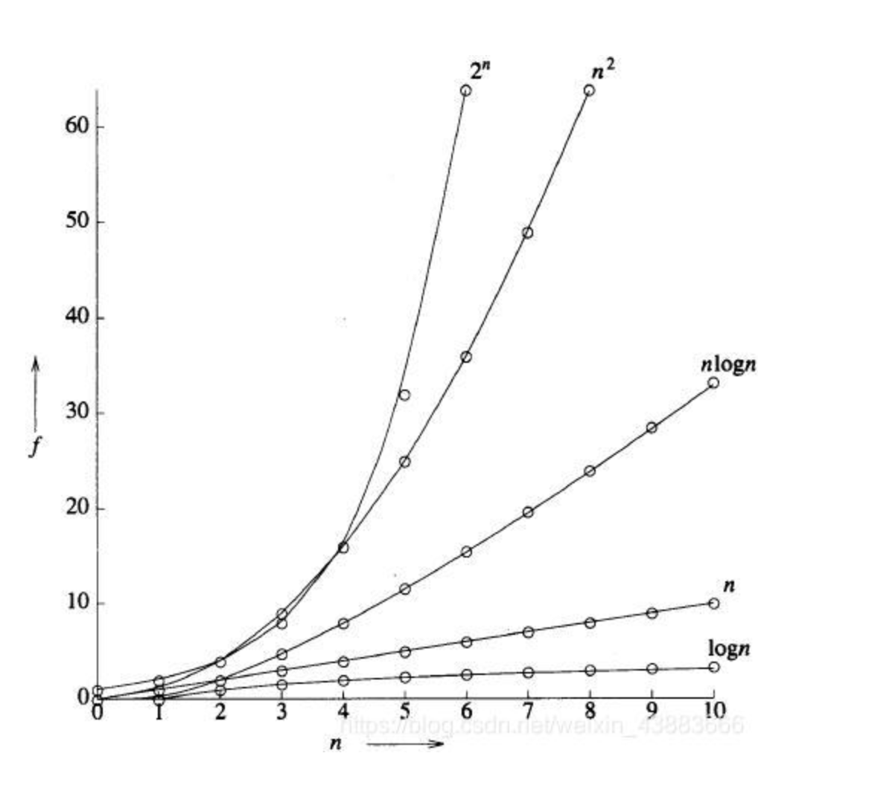

## 常见数据结构[参考王争先生的数据结构与算法之美课程]
### 数据结构目录
   - 数组
   - 链表
   - 散列表
   - 树
        + 二叉树
        + 红黑树
        + B-Tree
        + B+Tree
        + 多路查找树   
   - 图
   - 队列
   - 堆
   - 栈
   

### 常见算法目录
   - 快速排序
   - 冒泡排序
   - 插入排序
   - 递归
   - 冒泡排序
   - 斐波那契算法
   
##### 数据结构入门
###### 1. 时间复杂度 [表示算法的执行时间和数据规模之间的增长关系]

   - 加法法则
     + 总的时间复杂度为量级最大的那段代码的时间复杂度.
       时间复杂度为O(n)
     + 若有两个不定量级的数据规模,如(m,n). 时间复杂度为O(m+n)
   - 乘法法则
     + 通常用于嵌套循环中,如一个循环中调用了另一个循环函数.
     那么该代码的时间复杂度为O(n²)
     + 若为多个不定量级,则复杂度为O(n*m)等
   - 常见的时间复杂度
     - 多项式量级
       + O(1): 常量阶[代码的执行时间不随着不定量级的增长而增长]
       + O(logn): 对数阶[等比数列]
       + O(n): 线性阶
       + O(nlogn): 线性对数阶[循环内嵌套对数阶]
       + O(n²): 平方阶
       + O(n³): 立方阶
       + O(nk): k次方阶
     - 非多项式量级(随着数据规模越大,执行时间急剧增加)
       + O(2n): 指数阶
       + O(!n): 阶乘阶
      
###### 2. 空间复杂度 [表示存储空间和数据规模之间的增长关系]
   - 常见的空间复杂度
     + O(1): 常量阶
     + O(n): 线性阶[new一个不定量级长度的对象/数组等]
     + O(n²)
     + O(logn)/O(nlogn): 不常用

###### 3. 时间复杂度细化
   - 最好情况时间复杂度
     + 最理想情况下出现的时间复杂度
   - 最坏情况时间复杂度
     + 最坏情况下出现的时间复杂度
   - 平均情况时间复杂度
     + 一般为加权平均值(需要考虑到各种情况,进行运算) 一般为O(n)
   - 均摊时间复杂度
     + 大多数为一种情况,偶然出现第二种情况,那么均摊时间复杂度为情况一
       
##### 数据结构基础篇
###### 1. 数组
   - 概念
     + 数组: 是一种线性表数据结构,用一组连续的内存空间来存储相同类型的数据
     + 线性表: 是数据排成像线一样的结构,每个线性表只有前或后两个方向. 如: 数组,链表,栈,队列都属于线性表
     + 非线性表: 数据间并不是简单的前后关系. 如: 堆,图,树等
   - 数组特点
     + 连续的内存空间和相同类型的数据
        1. 优点: 随机访问
        2. 缺点: 为保证连续性,需要做大量的数据搬移工作
     + 数据根据下标随机访问的实现
        1. 计算机通过该数组的内存地址访问,寻址公式: a[i]_address = base_address + i * data_type_size(表示数组中每个元素的大小,单位字节).
        其实下表最确切的定义是偏移.如果用a标识数组的首地址,a[0]就是偏移为0的位置.a[k]就表示偏移k个type_size的位置,所以用上述公式就可以了.
        但如果下标从1开始,后续i的计算都需要-1. 即: base_address + (k-1) * type_size.
        所以如果从1开始,CPU就多了一次减法指令,这也是下标为0的原因.当然,也可能是历史原因,因为从C语言开始,设计者就用0做数组下标.
        2. 根据数组下标随机访问的时候,时间复杂度为O(1). 而整体查找的时间复杂度,几遍是排好序的数组,用二分查找,时间复杂度也是O(logn).链表的增删改则为O(1)
     + 低效的插入和删除
        1. 数组具有连续性,会导致插入删除这两个操作比较低效. 因为他是把插入位置以后的数据进行移动,所以平均时间复杂度是(1+2+3+...+n)/n = O(n)
        如果数据是有序的,就必须将后续数据进行移动,若是无序的,则可以更换位置,如: 将插入位置的原数据放到数组最后,把新元素放入插入位置.
        2. 删除时除了上述移动后续数据的方法,某些特殊场景下,我们可以先把删除的数据进行标记,等到数组没有更多空间的时候,在触发执行一次真正的删除.这样可以大大减少删除操作导致的数据搬移. 这一点和JVM的标记清除垃圾回收算法的核心思想一样
   - 容器和数组的使用场景
     + ArrayList容器
        1. 讲很多数组操作的细节进行封装,且支持动态扩容.但因为扩容操作设计内存申请和数据搬移,比较耗时,所以如果能事先确定好需要存储的数据大小,最好在创建的时候指定大小
     + 数组
        1. 因为容器不支持基本数据类型,而封装类是有一定性能消耗的,所以如果特别关注性能追求极致,或者需要使用基本数据类型,可以使用数组. 若是数据大小事先已知,并且对数据操作简单,用不到大多数封装方法,也可以直接使用数组 
###### 2. 链表
   - 概念
     + 是一种线性表数据结构,通过指针将一组零散的内存串联起来使用.我们吧每一个内存块称为链表的结点.
     + 为了将所有的结点串起来,每个链表的结点除了存储数据之外,还需要记录链上的下一个结点的地址所以我们把这个记录下个结点地址的指针叫做后继指针next
   - 链表特点
     + 高效的插入删除
        1. 通过指随时增加或删除结点,所以时间复杂度为O(1).
     + 低效的查询
   - 链表类别
     1. 单链表
        + 单链表有两个结点比较特殊,分别是头结点和尾结点.头结点用来记录链表的基地址,通过它可以遍历整条链表.尾结点的指针不指向下一个结点,而是指向一个空地址NULL
        + 遍历时,链表就向一个队伍,队伍中的每个人只知道自己后面的人是谁,所以当我们希望知道排在k位的人是谁时,
            我们就需要从第一个人开始,一个一个往下数,所以链表随机访问的性能没有数组好,需要O(n)的时间复杂度
     2. 循环链表
        + 循环链表和单链表唯一的区别在于尾结点,单链表尾结点指向NULL,而循环链表尾结点指向头结点
        + 优点: 从链尾到链头比较方便,当要处理的数据具有环形结构特点时,就特别适合采用循环链表.如:  <big>[约瑟夫问题-见代码](src/main/java/com/ssq/demo/base/dataStructure/linkedList/JosefCircle.java)</big>
     3. 双向链表
        + 双向链表可支持两个方向,每个节点不止有一个后继指针next指向后面的结点,还有一个前驱指针prev指向前面的结点.
        + 双向链表需要额外的两个空间来存储后继结点和前驱结点的地址.所以如果存储同样多的数据,双向链表比单链表占用更多的空间,但可以支持双向遍历,也增加了链表的灵活性
        + 优点: 从结构来看,双向链表可以支持O(1)时间复杂度的情况下找到前驱结点,所以在某些情况下,双向链表的插入删除等操作都比单链表简单高效.
        + 删除操作解析(两种情况) - 插入同理:
            1. 删除结点中"值等于某个给定值"的结点
                    - 需要从头遍历对照,找到该值进行删除.虽然单纯的删除操作时间复杂度为O(1),但遍历查找的时间是主要的耗时点,为O(n); 所以根据时间复杂度分析中的加法法则,链表操作该删除值的总时间复杂度为O(n).
            2. 删除给定指针指向的结点
                    - 我们已经找到了要删除的结点,但是删除某个结点q需要知道其前驱结点,而单链表并不支持直接获取前驱结点,还是要从头节点开始遍历链表,直到p -> next = q. 说明p是q的前驱结点
                    - 但对于双向链表来说,这种情况就比较有优势了.因为双向链表中的结点已经保存下来了前驱结点的指针,不需要像单链表一样遍历.所以针对第二种情况,双链表的时间复杂度就为O(1)了.
            + 查询优势
                1. 可以记录上次查找的位置p,每次查询时,根据要查找的值与p的大小关系来决定是向前啊还是向后查找.所以平均只需要查找一半的数据
     4. 双向循环链表
     5. 空间换时间思想
        + 当内存空间充足的时候,如果我们更加追求代码的执行速度,就可以选择空间复杂度相对较高,但时间复杂度很低的算法或者数据结构.相反,如果内存紧缺,就要反而行之.
   - 链表实现注意事项
     1. 理解指针或引用的含义
        + (引用谷歌工程师王争定义)将某个变量赋值给指针,实际上就是将这个变量的地址赋给指针,或者反过来说,指针中存储了这个变量的内存地址,指向了这个变量,通过指针就能找到这个变量.
        + (本人理解)指针即节点,不论我们定义的prev/next变量,本质为存放的前后结点中带了一个指向箭头,让该节点有了特定的方向轨迹
     2. 警惕指针丢失和内存泄漏
        + 指针是指向后续节点的,若先将当前指针和新插入的指针进行连接,那新节点与后续节点就断了连接,所以在插入节点时,要注意操作的顺序.
     3. 利用哨兵简化实现难度
        + 在插入与删除时,我们通常要考虑链表为空的情况进行特护处理,若加入哨兵,head指针就会一直指向该哨兵节点
            1. 有哨兵节点的被称为**带头链表**
            2. 没有哨兵节点的被称为**不带头链表**
     4. 留意边界条件处理
        + 链表为空时,代码是否可以正常工作
        + 链表只包含一个节点时,代码是否能正常工作
        + 链表只包含两个节点时,代码是否能正常工作
        + 代码逻辑在处理头节点和尾节点时,是否能正常工作
     5. 举例画图,辅助思考
        + 在链表操作十分复杂时,运用画图/举例的方式缕清思路
   - 用途
     + 缓存
        1. 缓存是一种提高数据读取性能的技术,在硬件设计,软件开发中都有着非常广泛的应用,比如常见的CPU缓存,数据库缓存,浏览器缓存等.
        而缓存大小有限,当缓存被占满时,数据的去留则需要缓存淘汰策略来决定.
        常见的有三种:先进先出策略(FIFO),最近最少使用策略(LFU),最少使用策略(LRU)
        2. 缓存实际上利用了空间换时间的设计思想.虽然吧数据加载在内存中耗费空间,但数据查询速度非常快
     + LRU缓存淘汰算法实现思路
        1. 维护一个有序单链表,越靠近链表尾部的结点是越早之前访问的.当有一个新的数据被访问时,我们从链表头开始顺序遍历链表.
        2. 如果此数据之前已经被缓存到链表中了,我们遍历得到这个数据对应的结点,并将其从原来的位置删除,然后在插入到链表的头部.
        3. 如果此数据没有在缓存链表中,可分为两种情况:
            + 如果此时缓存未满,则将此结点直接插入到链表头部
            + 若缓存已满,则链表尾结点删除,将新的插入到头部
        - 此时,不管缓存有没有满,我们都需要遍历一遍链表,所以这种基于链表的实现思路,时间复杂度为O(n).**而散列表可以将时间复杂度降到O(1).**
   - 数组和链表性能比拼
     + 数组开辟的是一块连续的内存空间.
        1. 缺点: 大小固定,一经声明占用整块连续内存空间,若声明的数组过大,系统可能没有足够的连续内存分配给他导致内存不足.或者声明过小需要扩容
     + 链表不是连续存储
        1. 缺点: 对CPU缓存不友好,没有办法有效预读.
        2. 优点: 大小没有限制,天然的支持动态扩容
   - 链表算法练习
     + src/main/java/com/ssq/demo/base/dataStructure/linkedList
        1. 单链表反转 -> ReverseLinkedList
        2. 链表中环的检测,并寻找入环点(此代码搬网上解法,有问题) -> CheckCircle
        3. 判断两链表是否相交,并找出相交点 --> MargeLinkedList
        4. 删除链表倒数第n个节点 --> DeleteLinkedListNode
        5. 求链表中间的节点 --> LinkedListMiddle
        6. 基于单链表实现的LRU缓存淘汰算法(最少使用策略) -> LruCacheMiniVisits
        7. 循环链表实现约瑟夫环 -> JosefCircle
        8. 循环链表的实现方式(未完) -> LruCacheCircleLinked
###### 3. 栈
   - 概念
     + 是一种后进先出的线性表
   - 特点
     + 操作受限
       1. 数据和链表可以代替栈,但是由于数据/链表暴露了太多的操作接口,在对于一些特定的限制性较强的功能中,会产生不可控因素,出错率更高
       2. 当某个数据集合只涉及在一端插入和删除数据时,并且能满足后进先出,先进后出的特性,这时就可以选择栈
   - 适用场景
     + 浏览器的快进和后退,当我们访问了a,b,c三个页面时,从c回退到b,在b页面在进入d,这个时候就再也无法通过前进/后退查看页面c了
        1. 创建两个栈, 其中一个栈存访问的轨迹,当回退到之前页面时,就将第一个栈内的元素一次放到第二个栈内.
        2. 直到从某一个页面进入另一个页面时,第二个栈内元素将会被清空,这样被清空的页面元素就再也无法查看了
     + 函数调用栈: 
       1. 操作系统给每个线程分配了一块独立的内存空间,这块内存被组织成'栈'这种结构,用来存储函数调用时的临时变量.
       2. 每进入一个函数,就会将临时变量作为一个栈帧入栈,当被调用函数执行完成,返回之后,将这个函数对应的栈帧出栈.
     + 表达式求值就是分别将数字和运算符压入栈中,比较运算符的优先级,当当前优先级比栈内的优先级低的时候,栈内的元素进行运算
     + 括号匹配: 用来检查表达式是否非法,存在不对称的大中小括号
   - 实现
     + 操作方式:
       1. 入栈
       2. 出栈
     + 实现方式:
       1. 数组: 顺序栈
       2. 链表: 链式栈
   - 逻辑问答
     + 为什么函数调用要用'栈'来保存临时变量,别的不行吗?
       1. 答: 也可以,但是由于栈独有的操作限制性,更加保险,别的方式有违规操作的风险.
     + JVM内存管理中的堆栈和数据结构的栈一样吗?
       1. 答: 不一样, 内存中的堆栈是真是存在的物理区,数据结构中的堆栈是抽象的数据存储结构.
       2. JVM的栈区存储运行方法的形参,局部变量,返回值.由系统自动分配和回收.
       3. JVM的堆区存储对象(真实的数据)
   - 递归
     + 递归定义: 自己调用自己的过程,但需要有一个出口.否则会将栈溢出
     + 递归本质: 将数据压入栈中,每一次循环,压栈一次,直到找到出口条件,在依次将栈内的节点取出,并执行后续处理,直到栈被清空
     + 特点: 
       1. 优点:
            + 代码表达力强,代码非常简洁
       2. 缺点
            + 空间复杂度高
            + 有栈溢出风险
            + 存在重复计算,过多函数调用,耗时多
###### 4. 队列
   - 概念
     + 先进先出
   - 特点
     + 操作受限
   - 适用场景
     + 各个底层系统,框架:
       1. 阻塞队列[生产消费者模型]: 当队列为空的时候,从队头取数据会被阻塞.因为此时还没有数据可取,知道队列中有了数据才能返回,如果队列已经满了,那么插入数据的操作就会被阻塞,直到队列中有空闲位置后在插入数据,然后再返回.而且基于阻塞队列我们可以配置多个消费者来应对一个生产者
       2. 并发队列[线程安全]: 基于数组的循环队列,可以利用CAS原子操作,可以实现非常高的并发队列.所以循环队列比链式队列运用更加广泛
   - 实现
     + 操作方式
       1. 入队: 放一个数据到队列尾部
       2. 出队: 从列头取一个元素
     + 实现方式
       1. 数组: 顺序队列
       2. 链表: 链式队列
   - 逻辑问答
     + CPU: 
       1. CPU资源是有限的,任务的处理速度与线程个数并不是线性正相关.
       2. 相反,过多的线程反而会导致CPU频繁切换,处理性能下降.所以线程池的大小一般都是总和考虑要处理任务的特点和硬件环境,来事先设置的.
     + 线程池没有空闲线程时,新的任务请求线程资源,线程池如何处理这个请求?
       1. 非阻塞处理方式: 直接拒绝任务请求
       2. 阻塞处理方式: 将请求排队,等到有空闲线程时,取出排队的请求继续处理
          + 处理排队请求时,要保证公平,先请求的先处理,但针对响应时间比较敏感的系统,基于链表实现的无限排队的线程池是不合适的.
          + 数组有界队列好处:队列大小有限,所以线程池中排队的请求超过队列大小时,接下来的请求就会被拒绝.但是设置一个合理的队列大小,也是有很多讲究的
     + 对于大部分资源有限的场景,当没有空闲资源时,基本都可以通过队列这种数据结构来实现请求排队
###### 5. 排序
   - 排序类别
     + 冒泡排序
     + 插入排序
     + 选择排序
     + 归并排序
     + 快速排序
     + 计数排序
     + 基数排序
     + 桶排序
   - 时间复杂度
     + O(n2): 冒泡,插入,选择
     + O(nlogn): 快排,归并
     + O(n): 桶,计数,基数
   - 分析排序算法
     + 执行效率: 
       1. 最好情况,最坏情况,平均情况的时间复杂度:
        + 有序度不同的数据,对排序的执行时间会有影响,所以我们要知道排序算法在不同数据下的性能表现
       2. 时间复杂度的系数,常数,低阶
     + 内存消耗(空间复杂度)
       1. 原地排序: 指的就是空间复杂度为O(1)的排序算法
     + 稳定性
       1. 列表内有两个重复的数据,若两个重复数据的前后顺序未改变,我们就说该算法是稳定的.
       2. 如: 电商交易系统内订单排序.订单有两个属性:1.时间 2.金额.若金额一样的情况下按时间大小排序,就可以使用稳定排序算法来实现
   - 算法原理
     + O(n2): 
       1. 冒泡排序: 对数据进行两次嵌套遍历,第一次控制总遍历次数,第二层比较相邻元素,按条件对元素进行交换. 
       2. 插入排序: 对数据进行两次嵌套遍历,当前下标元素与前面的元素依次对比,若条件相反则将不符合的值依次向后移动一位.直到符合条件,将要插入的元素插入当前下标位置
       3. 选择排序: 对数据进行两次嵌套遍历,先存储第一次遍历的下标,然后进行二次遍历,依次与第一次的下标元素进行比较,若条件相反则将初始化的下标替换为当前下标,然后继续遍历,直到符合条件,然后在第一层遍历中交换两下标元素的位置
       - 对比: 冒泡和插入排序是稳定的排序算法,因为两个相同元素不会再次交换位置,而选择排序若存在同样大小的元素会导致他们的位置发生变化
#### 内存相关(零碎知识点,后期整理)
> 写链表时关于赋值出现的疑问,特此记录
  - 数据传递
    + 值传递
      1. 方法调用时,传递的参数是拷贝传递,即传递后以前与现在的值互不关联(以前的值被覆盖)
    + 引用传递
      1. 在方法调用时,传递的参数按引用进行传递,其实传递的是引用的地址,也就是变量锁对应的内存空间的地址.即传递的是值的引用,传递前和传递后都指向同一个引用(同一个内存空间)
  - 基础
    + i++和++i
      1. 单独执行该代码的时候,i++是先执行代码在自增,++i是先自增在执行
      2. 在for循环中先执行完循环体内的代码后在进行++i/i++,所以最后得到的结果是一样的
      3. 但在时间效率方面有差距,i++相当于先申请了一块内存来存储自增前的值,而++i是直接自增,所以效率略高
   